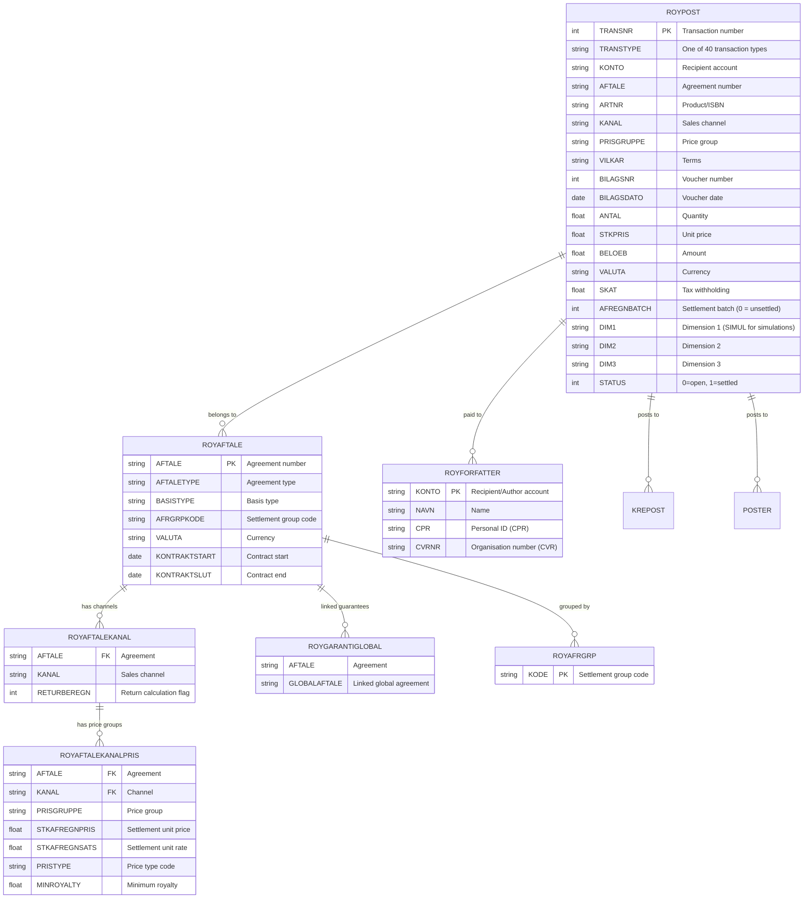
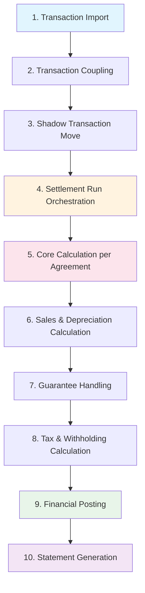
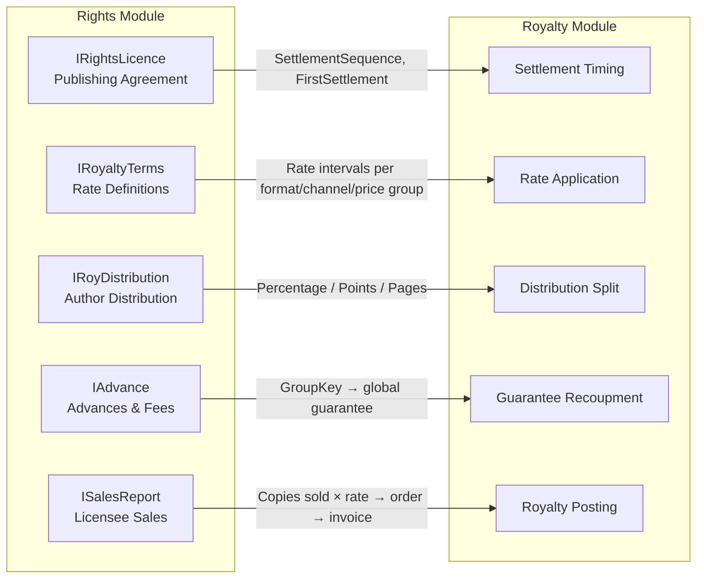

# Royalty Settlement Calculation & Validation

## System Overview

The Schilling ERP Royalty module is a full royalty settlement system for the publishing industry. Written in C++ with Oracle SQL (OCI cursor-based), it handles the entire lifecycle from raw sales-transaction import through royalty calculation to payment statements, tax reporting, and financial posting.

### Module Architecture

| Layer | Directory | Purpose |
|-------|-----------|---------|
| **Core Library** | `Royalty/Lib/` | Calculation engine, settlement logic, report formatting, DB helpers |
| **Domain Objects** | `Royalty/Objects/` | Modern C++ ORM layer — agreement, settlement, tax, cost objects |
| **Batch Programs** | `Royalty/Batch/` | Scheduled/CLI programs (settlement runs, imports, data generation) |
| **Applications** | `Royalty/Apps/` | Interactive UI screens (settlement management, rates, tax) |
| **Transactions** | `Royalty/Trans/` | Import, coupling, compression, and summarization of royalty postings |
| **Reports** | `Royalty/Report/` | Daily transaction reports and period settlement reports |
| **Master Data** | `Royalty/Master/` | Author, tax, price type, VAT control, and channel maintenance screens |
| **Events** | `Royalty/Events/` | `RoyAmountEvent` — fired on every royalty posting for downstream modules |

---

## Data Model

### Core Database Tables



### Key Relationships

- **ROYPOST** is the central royalty ledger. Every transaction (sale, return, guarantee, advance, tax, payment) is a row. `AFREGNBATCH = 0` means unsettled.
- **ROYAFTALE** holds agreement master data. An agreement links a product catalogue to one or more recipients through channels and price groups.
- **ROYAFTALEKANAL** defines which sales channels are active on an agreement, including the return-calculation flag.
- **ROYAFTALEKANALPRIS** defines the price group terms per channel — the actual royalty rates, price types, and minimum royalty thresholds.
- **ROYGARANTIGLOBAL** creates a tree structure linking agreements for global guarantee recoupment across multiple titles/formats.
- **ROYFORFATTER** is the royalty recipient (author/agent/heir) master record.
- **ROYAFRGRP** groups agreements into settlement groups processed together.

---

## Transaction Types

All 40 transaction types are defined in `Royalty/Lib/Roy.h` as constants with their corresponding database string keys stored in the `RoyTransTypeTekst[]` array.

| # | Constant | DB Key | English Meaning |
|---|----------|--------|-----------------|
| 0 | `ROYOPLAG` | Oplag | Stock/print-run quantity |
| 1 | `ROYFRIEKS` | Frieks | Free copies |
| 2 | `ROYSALG` | Salg | Sales |
| 3 | `ROYSALGTILB` | SalgTilb | Sales returns (credit) |
| 4 | `ROYRETURNERET` | Returneret | Returns |
| 5 | `ROYSVIND` | Svind | Wastage/shrinkage |
| 6 | `ROYUDBETALT` | Udbetalt | Paid out |
| 7 | `ROYSKAT` | Skat | Tax withheld |
| 8 | `ROYAFGIFT` | Afgift | Social duties/levies |
| 9 | `ROYMOMS` | Moms | VAT |
| 10 | `ROYSALG` | Salg | Sales (primary) |
| 14 | `ROYGARANTILOKAL` | GarLokal | Local guarantee |
| 15 | `ROYGARANTILOKMOD` | GarLokalMod | Local guarantee offset |
| 16 | `ROYGARANTIGLOB` | GarGlobal | Global guarantee |
| 17 | `ROYGARANTIGLOBMOD` | GarGlobalMod | Global guarantee offset |
| 18 | `ROYFORSKUD` | Forskud | Advance |
| 19 | `ROYFORSKUDMOD` | ForskudMod | Advance offset |
| 20 | `ROYANTOLOGI` | Antologi | Anthology |
| 21 | `ROYANTOLOGIMOD` | AntologiMod | Anthology offset |
| 22 | `ROYERSTATNING` | Erstatning | Compensation (one-time payment) |
| 26 | `ROYAFREGNJUST` | AfregnjJust | Settlement adjustment |
| 27 | `ROYPRODUKTION` | ProdRoy | Production royalty |
| 28 | `ROYPRODUKTIONRY` | ProdRoyArv | Production royalty (inherited) |
| 29 | `ROYPENSION` | Pension | Pension deduction |
| 30 | `ROYAMBI` | Ambi | AMBI (labour market contribution) |
| 31 | `ROYENGANGHONORAR` | EngangsHonorar | One-off fee (hidden on statement) |
| 32 | `ROYRENTE` | Rente | Withheld interest |
| 35 | `ROYOVFBRUTTO` | OvfBrutto | Balance adjustment (gross carry-over) |
| 37 | `ROYGARANTIMETHOD` | GarMethod | Method guarantee |
| 38 | `ROYGARANTIMETHMOD` | GarMethodMod | Method guarantee offset |
| 39 | `ROYGROSSAMOUNT` | GrossAmount | Gross amount before taxes/VAT |

---

## Settlement Calculation Flow

The full settlement flow is a 10-step pipeline from raw transaction import to printed/digital statements.



### Step 1 — Transaction Import

**Source**: `Royalty/Batch/IndTrans/IndTrans.cpp`

Royalty transactions arrive from external sources (order systems, CSV files, ERP integration) and are loaded into staging tables:

| Staging Table | Source |
|---------------|--------|
| `ROYIMPORT` | Standard sales/return transactions |
| `ROYIMPORT_OLF` | OLF (online fulfilment) transactions |
| `ROYIMPORT_PAY` | Payment/advance-related transactions |
| `ROYIMPORTERR` | Transactions that failed validation (held for correction) |

The `IndTrans` batch program parses CSV records of type `ROYTRANS` containing: transaction type, product, date, quantity, price, channel, price group, free-copy type, and dimensions. Each parsed record is inserted into `ROYPOST` via `OpretRoypost()`.

### Step 2 — Transaction Coupling

**Source**: `Royalty/Trans/ImportTransactions.cpp`

The coupling engine reads from the staging tables and bundles related rows into `CoupledTransaction` objects. This handles:

- **Multi-agreement imports**: A single sale may need to generate royalty entries across multiple agreements (e.g., hardcover + ebook + audiobook under different terms).
- **Sheet-based imports**: Transactions grouped by transaction sheet for batch assignment.
- **Recalculation**: If rate or agreement data has changed since the original import, totals are recalculated.
- **Error recovery**: `MoveRoyImpErrToRoyImp` moves corrected error records back into the main import pool.

Key events in the coupling process:
1. `CoupleTransactions` — matches import rows to agreements
2. `PostBundleIfLastTransaction` — commits the bundle when the last row is processed

### Step 3 — Shadow Transaction Move

**Source**: `Royalty/Lib/FlytTrans.cpp` → `FlytSkyggeTransaktioner()`

Shadow transactions are provisional royalty entries in `ROYPOST` (status = pending) that represent expected future sales. Before settlement, they must be moved into the active batch. The function:

1. Validates no pending imports remain
2. Confirms all transactions are matched by their shadow counterparts
3. Moves qualifying shadow entries from pending to active status

### Step 4 — Settlement Run Orchestration

**Source**: `Royalty/Objects/SettlementRun/SettlementRunProcessor.cpp`

The `SettlementRunProcessor` manages the batch processing loop:

```
For each entry group:
  For each RecipientData entry (status == Pending):
    1. CheckStopped() → throw StoppedException if user halted run
    2. ProcessEntry(wrapper):
       a. SkipRoyaltyRecipient? → update status only
       b. SkipEntry? (no transactions / not ready / no specific/rights trans)
          → For final runs: UpdateNextSettlementDate()
       c. SetupVoucherNumber() → allocate voucher number
       d. RoyAfregning(...) → CORE CALCULATION
       e. On success: RoyCommitAfregn(), update status
       f. On error: RoyRollbackAfregn(), log error
    3. cscommit()
```

**Voucher Number Scoping** (controlled by `VoucherNoSettle` systab):

| Mode | Behaviour |
|------|-----------|
| `PER_AGREEMENT` | New voucher number for every agreement |
| `PER_BATCH_ID` | New voucher number per batch |
| `PER_CREDITOR` | New voucher number per recipient + batch combination |

### Step 5 — Core Calculation

**Source**: `Royalty/Lib/Gem.cpp` (primary) and `Royalty/Lib/Bogfor.cpp` (agreement-editor context)

The core function `RoyAfregning()` is called per agreement/recipient pair:

```c
int RoyAfregning(
    agreement, accountNo, settlementDate, postingSetting,
    voucherDate, voucherNumber, voucherText, returnDate,
    batchId, transactionStack, mainRecipient, printType,
    withhold, runThrough, fCode, settlementBatchId,
    reportFormat, dueDate, readyForSettlement, toWeb,
    settlementText, paymentDate
);
```

**What it does:**

1. Reads unsettled posts from `ROYPOST` where `AFREGNBATCH = 0` for the given agreement/recipient
2. Populates the `SalgArray` linked list — each node holds: product, channel, price group, terms, currency, quantity, amounts, royalty rates, author rate, and price group deduction
3. Groups entries by channel / price group / transaction type
4. Applies the royalty rate from `ROYAFTALEKANALPRIS` (unit rate × quantity, or percentage × amount)
5. Handles FIFO/LIFO return matching via `ReturArray` linked list (in `Bogfor.cpp`)
6. Computes the royalty amount, applying price type rules, currency conversion, and cost deductions
7. Creates settlement postings and sets `AFREGNBATCH` on processed entries
8. Fires `RoyAmountEvent` for each posting
9. Integrates with the project module via `gen_projektpost_roy` (if applicable)

### Step 6 — Sales & Depreciation Calculation

**Source**: `Royalty/Lib/Calculate.cpp`

This step aggregates sales data and applies depreciation rules:

- **`LoadSales()`** — SQL query against `ROYPOST` aggregating by `TRANSTYPE IN (Salg, SalgTilb, Returneret, Svind)` up to the settlement date
- **`LoadLocalSales()`** / **`LoadGlobalSales()`** — sales loading scoped to a single agreement vs. the global guarantee tree
- **`LoadDepreciationPerCent()`** — calculates the applicable depreciation percentage for a given rule and date
- **`UpdateDepreciationRule()`** — updates depreciation state based on accumulated sales
- **`FillDepreciationSum()`** — populates the depreciation summary for reporting

### Step 7 — Guarantee Handling

Guarantees are advances committed to an author that are recouped from earned royalties. Three guarantee scopes exist:

| Type | Scope | DB Key |
|------|-------|--------|
| **Local Guarantee** | Single agreement | `GarLokal` / `GarLokalMod` |
| **Global Guarantee** | Across linked agreements (via `ROYGARANTIGLOBAL` tree) | `GarGlobal` / `GarGlobalMod` |
| **Method Guarantee** | Specific calculation method | `GarMethod` / `GarMethodMod` |

**Processing** (`Afregn.cpp` → `RoySkrivGaranti()`):

1. Loads guarantee amounts via `RoyHentGlobGaranti2()` and `RoyHentGaranti()`
2. Calculates earned royalty vs. guarantee balance
3. If earned royalty < guarantee: no payout, the difference remains on the guarantee
4. If earned royalty > guarantee: guarantee is fully offset, surplus is paid out
5. Posts guarantee offset transactions (`*Mod` types) to `ROYPOST`
6. `RoyHentRente()` loads any withheld interest on guarantee balances

For **profit-sharing agreements**, `HandleDueRoyalty()` and `PostDueRoyalty()` manage accrual posting:
- Offset existing due-royalty entries
- Post new due-royalty amounts to accrual/due-royalty accounts

### Step 8 — Tax & Withholding Calculation

**Source**: `Royalty/Objects/TaxCalculation/TaxCalculation.hpp`

Tax calculation is handled by the `TaxCalculation` domain object:

| Method | Purpose |
|--------|---------|
| `GenerateIntermediateCalculations()` | Generates multi-level deduction, tax, and set-off lines from configured tax codes |
| `GetResult()` | Returns gross amount minus correct withholding |
| `GetTaxAmount()` | Returns amount to withhold (minus any exemption lines) |
| `GetAccumulatedGrossAmount()` | Returns cumulative basis for same creditor/period |

Tax-related transaction types posted to `ROYPOST`:

| Type | Meaning |
|------|---------|
| `Skat` | Income tax withheld |
| `Afgift` | Social duties |
| `Moms` | VAT |
| `Pension` | Pension deduction |
| `Ambi` | Labour market contribution (AM-bidrag) |
| `GrossAmount` | Pre-tax gross amount |

**VAT Control** (`Royalty/Lib/DivRut.cpp` → `CheckCombination()`):
Validates the combination of posting group, VAT code, and TIN/CVR to ensure correct tax treatment. Invalid combinations are rejected at settlement time.

### Step 9 — Financial Posting

**Source**: `Royalty/Lib/InsRoyPost.h`

Settlement results are bridged to the financial ledger:

1. `RoyFinTrans` struct carries the posting data (account, amount, dimensions, voucher info)
2. Entries are inserted into `KREPOST` (creditor sub-ledger) and `POSTER` (nominal/general ledger)
3. `RoyAmountEvent` is fired for each posting, allowing downstream modules to react without tight coupling
4. For profit-sharing: `BogforProjekt.cpp` → `RoyaltyIProjekt()` also posts to the project module (validates project/activity state first)

### Step 10 — Statement Generation

**Source**: `Royalty/Lib/GenUdskriv.cpp` and `Royalty/Report/Periode/RoyGenUdskriv/`

Settlement statements are generated as printable/digital documents:

1. `GenUdskriv.cpp` loads and sorts settlement lines, generates sum pages
2. `Udskriv.cpp` writes the recipient header block (name, address, bank info)
3. The XSL form template (`SettlementForm` / `XSLRoyAfr3`) renders the final document
4. `GenerateSettlements` batch program handles re-printing for portal or postal delivery
5. Circulation documents are built for email/portal delivery
6. Email notification is sent via templates ("Din seneste royaltyafregning er nu klar" — "Your latest royalty settlement is now available")

**Statement Content** (`PaymentVoucherReport`):

Entries are grouped by agreement and recipient, with transaction types mapped to display categories:

| Display Category | Transaction Types Included |
|-----------------|---------------------------|
| Sales | Salg, SalgTilb, Returneret, Svind |
| Local Guarantee | GarLokal, GarLokalMod |
| Global Guarantee | GarGlobal, GarGlobalMod |
| Advance | Forskud, ForskudMod |
| Compensation | Erstatning |
| Anthology | Antologi, AntologiMod |
| Production | ProdRoy, ProdRoyArv |
| Method Guarantee | GarMethod, GarMethodMod |
| One-off Fee | EngangsHonorar |

---

## Settlement Types

The settlement engine supports five run modes, configured via `SettlementCriteria`:

| Type | Description | Financial Posting? |
|------|-------------|-------------------|
| **Preliminary** | Trial run — generates statements for review, no financial impact | No |
| **FinalWithPosting** | Production run — calculates, posts to ledger, generates statements, advances settlement dates | Yes |
| **FinalWithoutPosting** | Calculates and generates statements but does not post to ledger | No |
| **AgreementStatus** | Status inquiry — checks which agreements are due for settlement | No |
| **DueRoyalty** | Profit-sharing accrual calculation — posts to due-royalty/accrual accounts | Accrual only |

### Preliminary Settlement Batch

**Source**: `Royalty/Batch/PreliminarySettlements/PreliminarySettlements.cpp`

CLI options for fine-grained control:

| Option | Purpose |
|--------|---------|
| `deleteMode` | Clean up previous preliminary data |
| `sortMode` | Sort order for processing |
| `timing` | Performance instrumentation |
| `notReady` | Include "not ready" agreements |
| `onlyPortal` | Only process portal-delivery recipients |
| `onlyPassword` | Only process password-protected recipients |
| `limit` | Max number of recipients to process |
| `creditor` | Filter by specific creditor |
| `formname` | Statement form template override |
| `settlementgroup` | Filter by settlement group |
| `returndates` | Return-date filtering |

---

## Agreement Models

### Standard Agreement

The default model. Royalty is calculated directly on sales × rate, offset by guarantees and advances.

### Profit-Sharing Agreement

Enabled by the `RoyProfitShar` systab. Instead of per-unit royalty, the author receives a share of net revenue after deducting actual costs. `DueRoyaltyCalculation` computes monthly accruals and posts to accrual accounts.

Key cost objects: `ROY_COST` / `CostAgreement` — actual production and publishing costs (printing, marketing, distribution) deductible from revenue before the profit share is applied.

### Combined Agreement

Controlled by the `M_ROYKOMBIAFT` module flag. Multiple agreements are combined into a single settlement calculation — used when an author has separate agreements for different formats (hardcover/paperback/ebook) but settlement is consolidated.

Function: `CombinedAgreement()` checks the flag and routes to combined processing.

### Agent Agreement

When the upstream contract is managed by an agent (via the Rights module), the settlement behaviour differs:
- `ValidateSettleWhen()` forces `Invoicing` settlement timing
- Agent agreement header line is written by `SetAgentAgreementInfo()`

---

## Royalty Rate Calculation

### Price Types

26+ price type constants are defined in `Roy.h`, controlling how the royalty base price is derived:

| Constant | Meaning |
|----------|---------|
| `ROYPRIS_F_PRIS` | Publisher's list price (forlagspris) |
| `ROYPRIS_V_F_PRIS` | Guideline publisher's price |
| `ROYPRIS_REA_PRIS` | Remainder/sale price |
| `ROYPRIS_NETTO` | Net price (after discount) |
| ... | *(additional types per business configuration)* |

The price type determines which price field on the product/transaction is used as the basis for applying the royalty percentage.

### Rate Ladders (Staircase Rates)

**Source**: `Royalty/Objects/RoySharesLadder/`

Royalty rates can be structured as tiered/staircase schedules. The `RoySharesLadder` object maps quantity ranges to royalty percentages:

```
 Copies Sold    Rate
 0 – 2,000     10%
 2,001 – 5,000  12%
 5,001 – 10,000 15%
 10,001+        18%
```

`RoyFordelSalgMgd()` in `Afregn.cpp` distributes the total quantity across the ladder steps, calculating the blended royalty for each tier.

### Depreciation Rules

`Calculate.cpp` manages depreciation — the reduction of royalty rates over time or as editions become older:

- `LoadDepreciationPerCent()` looks up the applicable depreciation percentage for a given rule and date
- `UpdateDepreciationRule()` recalculates the depreciation state
- `FillDepreciationSum()` provides summary data for reporting

### Minimum Royalty

Each price group can define a `MINROYALTY` threshold in `ROYAFTALEKANALPRIS`. If the calculated royalty falls below this floor, the minimum is applied instead. Managed via the `MinimumRoyalty` application screen.

### Return Matching (FIFO/LIFO)

In `Bogfor.cpp`, returns are matched against sales using FIFO or LIFO ordering:

- `SalgArray` — linked list of sale transactions
- `ReturArray` — linked list of returns
- `TransnrArray` — tracks transaction numbers for matching
- `createReturn()` / `createChannelReturn()` — execute the matching and post reversal entries

### Post Compression

**Source**: `Royalty/Trans/KompRoypost/KompRoypost.cpp`

After settlement, many individual `ROYPOST` rows with the same key dimensions are compressed into summary rows (`ROYPOSTKOMP`) to reduce data volume. Compression groups by:

`(AFTALE, KANAL, PRISGRUPPE, TRANSTYPE, VILKAR, FRIEKSTYPE, STKAFREGNPRIS, STKAFREGNSATS)`

Rows are merged only when the price and rate match within a rounding tolerance of **0.01**.

---

## Co-Author & Inheritance Distribution

**Source**: `Royalty/Lib/Arv.cpp`

When a royalty agreement has multiple beneficiaries (co-authors, heirs, rights-holders), the computed royalty is distributed according to shares registered in `ROYMEDFORFATTER`:

- Each co-author/heir record specifies a **share percentage**
- The distribution covers: anthology postings, guarantee postings, and sales postings
- Used when a deceased author has registered heirs, or when multiple contributors share a work

The Rights module's `IRoyDistribution` defines distribution within a royalty group, supporting three methods:

| Method | Description |
|--------|-------------|
| **Percentage** | Each recipient gets a fixed % of the pool |
| **Points** | Shares calculated from allocated points |
| **Pages** | Shares calculated from page contribution |

`IRoyAuthorDistSetup` further controls whether double-taxation, exchange differences, and rounding differences are split proportionally among recipients.

---

## Validation Rules

### Agreement Validation

**Source**: `Royalty/Objects/RoyAgreement/RoyAgreementValidation.cpp`

The `RoyAgreement::Validator` chain contains **14 field validators**, all systab-driven (feature-flagged via system table entries):

| Validator | Systab Gate | Rule |
|-----------|-------------|------|
| `ValidateAgreementType` | `RoyAutAgreCont` | Must pass author/agreement type control check. Blocks type change if open/unsettled sales exist |
| `ValidateBasisType` | `RoyAftGLLock` | Read-only when locked |
| `ValidateBindingDeduction` | `RoyIndbindFill` | Required for non-profit-sharing agreements. Clears rate if deduction is cleared |
| `ValidateContractStart` | `RoyPerFraFill` | Required. Auto-advances end date if end < start |
| `ValidateContractEnd` | `CRRPeriodFlow` | Read-only once persisted (if systab set) |
| `ValidateInternationalAgreement` | `RoyUdlAftLock` | Read-only when locked |
| `ValidateStockViewType` | `NoStock` | Read-only if NoStock; reads default from `RoyDefaultPrimo` systab |
| `ValidateSettlementGroup` | `RoyAfrGrp` | Required and must exist. Read-only if systab absent |
| `ValidateTransactionSheet` | `RoyTransArk` | Read-only if absent. Checks in-use/locked state and process liveness |
| `ValidateCurrencyRBC` | `RoyaltyValuta` | Required. Blocks change if any settlement/guarantee/advance/anthology/adjustment exists |
| `ValidateNoStock` | `RoyAfrNoStock` | Read-only if absent |
| `ValidateSettleWhen` | *(always active)* | Forces `Invoicing` for non-agent agreements |
| `ValidateShowOnWWW` | `RoyPortal` | Read-only if portal feature disabled |
| `ValidateAgreementModel` | *(always active)* | Read-only if already a profit-sharing agreement |

### Settlement Criteria Validation

**Source**: `Royalty/Objects/SettlementRun/SettlementCriteria.cpp`

| Validator | Rule |
|-----------|------|
| `ValidateSettlementDateFrom` | From-date must be provided and valid |
| `ValidateSettlementType` | Must be a valid settlement type enum value |

### Author/Recipient Field Validation

**Source**: `Royalty/Master/Author/Author.od`

UI-level field validators on the author master screen:

| Validator | What It Checks |
|-----------|----------------|
| `E_ValidateAuthorNumber` | Valid and unique author number |
| `E_ValidateCRN` | Valid CPR/CVR/organisation number |
| `E_ValidateDutyCode` | Valid social duty code |
| `E_ValidatePensionCode` | Valid pension code |
| `E_ValidatePensionRate` | Rate within allowed bounds |
| `E_ValidateAmbiCode` | Valid AM-bidrag code |
| `E_ValidateAmbiRate` | Rate within allowed bounds |
| `E_ValidateTaxCode` | Valid tax withholding code |
| `E_ValidateTaxRate` | Rate within allowed bounds |
| `E_ValidatePostpone` | Valid postpone setting |
| `E_ValidateBirthDate` | Valid date |
| `E_ValidateAddressId` | Valid address reference |
| `E_ValidatePostCode` | Valid postal code |
| `E_ValidateVATCode` | Valid VAT code |
| `E_ValidateCostsPlace` | Valid cost centre |
| `E_ValidateOrgNo` | Valid organisation number |
| `E_ValidateDepartment` | Valid department |
| `E_ValidatePaymentCre` | Valid payment creditor |

### Co-Author & Settlement Date Validation

| Source | Validator | Rule |
|--------|-----------|------|
| `RoyCoAuthorValidation.cpp` | `ValidateSettlementDate` | Co-author settlement date must be valid and consistent with main |
| `RoyAgrAuthorValidation.cpp` | `ValidateNextSettlement` | Next settlement date must be after last settlement date |

### Business Rule Error Codes

Defined across `Royalty/Lib/RoyErr.h` and the language files:

| Error Code | Rule |
|------------|------|
| `ROY_AFREGNESFORAFREGNET` | Next settlement date must be after last settlement date |
| `ROY_AFREGN_ERR` | Settlement count must be > 0 |
| `ROY_AFRDAT_MAX` / `ROY_AFRDAT_MIN` | From-date must be ≤ to-date |
| `ROY_AFTALE_NXDEL_AFREGN` | Cannot delete agreement with unsettled transactions |
| `FOR_PERLUK` | Settlement period must be within a closed accounting period |
| `FORF_AC_AFRDAT` | Voucher date must not be before settlement date |
| `RIG_AUTSHA_TH` | Recipients' total share must not exceed 100% |
| `RIG_NO_1ST_SETTLE` | First settlement date field is required |
| `RIG_SETTLE_BEFORE_PAYMENT` | Payment date must be after first settlement date |
| `RIG_INVALID_1ST_SET` | First settlement corrected to beginning of valid period |
| `ROYERRINSPOST` | Error inserting royalty post |
| `ROYERRAFTNOAFR` | Agreement not found for settlement |
| `ROYERRTAXPERIOD` | Tax period error |
| `ROYCONTRACTTERMINATED` | Contract has been terminated |

### Channel / Price Group Constraints

**Source**: `Royalty/Master/TildPrisGrp.od`

- Only **one** channel per agreement/recipient/terms combination may have the return-calculation flag (`RETURBEREGN`) enabled
- `CheckKunEnBeregnPct()` validates this constraint
- `ChangeReturBeregn()` propagates changes across all price group rows for consistency

### Settlement Reversal Validation

**Source**: `Royalty/Report/Periode/RoyAfregnTilbage/`

`E_ValidateRoyaltyRecipients(batchId, settlementBatch, forceFlag)` checks:
- Returns `0` = OK / error (blocked)
- Returns `2` = warning requiring user confirmation before proceeding

---

## Rights Module Integration

The **Rights** module (`Rights/`) is the upstream contract and rate source that feeds into royalty calculations.

### Data Flow: Rights → Royalty



### Contract Setup (Purchase Side)

`IRightsLicence` establishes publishing agreements with:
- `SettlementSequence` — how many months between settlements
- `FirstSettlement` — when the first settlement runs

These drive the Royalty module's settlement run scheduling.

### Rate Definitions

`IRoyaltyTerms` (purchase side) and `ILicenceTerms` (sales side) define royalty rates broken down by:

**Rights Type → Format/Subtype → Sales Channel → Price Group → Rate Intervals**

Each `IRoyPriceGroupTrm` rate interval specifies the actual percentage or per-copy amount applied during settlement.

### Advance & Fee Recoupment

`IAdvance` records prepayments (types: advance, fee, digital files, production payment). The `GroupKey` field groups related advances for global guarantee tracking. `RightsAgreementFunctions` manages the global guarantee structure across multiple licences/formats.

### Incoming Sales Reports (Sales Side)

When a licensee reports sales:

1. `ISalesReport` + `ISalesLine` capture: product, channel, price group, copies sold, unit price, discount, statement amount
2. On save, an order is created (`E_CreateOrder`) flowing through `Ordre` → `Finans` to generate an invoice
3. `E_DistributeToRoyaltyRecipient` triggers royalty generation based on `ILicenceTerms` rates and `IRoyDistribution` splits

### Posting Setup

`IRightsPostingSetup` determines:
- Whether royalty entries are generated (`Royalty` flag)
- Whether to accrue them
- Which order/credit-note types are used
- How settlements flow through the general ledger

---

## Tax Reporting

### Danish Tax Authority (SKAT) Reporting

**Source**: `Royalty/Report/Periode/RoySkatOplys/RoySkatOplys.cpp` and `Royalty/Lib/RoyTax.cpp`

The system generates XML reports for the Danish tax authority covering B-income and KU (kontroloplysninger) reporting:

| Key Type | Description |
|----------|-------------|
| `CPR` | Personal identification number (Danish) |
| `SE` / `CVR` | Business/organisation number |
| `TIN` | Tax identification number (international) |

Data flows from `TaxReportHead` / `TaxReportedAmounts` objects into the XML output, with address compression and formatting handled by `RoyTax.cpp`.

### Tax Withholding Management

The `TaxWithholding` application maintains `TaxWithholdHead` / `TaxWithholdLine` / `TaxWithholdPeriod` objects — configuring how much tax to withhold per period per recipient.

---

## Simulation

**Source**: `Royalty/Lib/RoySimulering.cpp`

The royalty simulator allows users to preview estimated royalties without committing:

1. Simulated postings are written to `ROYPOST` with `DIM1 = 'SIMUL'`
2. Results are extracted and displayed
3. On exit, all simulated rows are deleted from `ROYPOST`

This provides a safe way to test "what if" scenarios (rate changes, additional sales, etc.) before running actual settlements.

---

## Audit Logging

**Source**: `Royalty/Lib/Log.cpp`

Every settlement action is logged to the `ROYLOG` table via `insroylog()` / `insertroylog()`:

| Field | Content |
|-------|---------|
| Program name | Which program performed the action |
| Action | What happened (process, commit, rollback, error) |
| Agreement | Affected agreement number |
| Product | Affected product/ISBN |
| Account | Recipient account |
| Batch ID | Settlement batch |
| Dates | Settlement date, voucher date |
| Voucher | Voucher number |

This provides a full audit trail for regulatory compliance and issue investigation.

---

## Key Source Files Reference

| File | Purpose |
|------|---------|
| `Royalty/Lib/Roy.h` | Master header: 40 transaction type constants, 26+ price type constants, `RoypostType` struct |
| `Royalty/Lib/RoyStructs.h` | `RoypostType` struct definition (full ROYPOST row model) |
| `Royalty/Lib/RoyErr.h` | ~80 named error codes for the calculation engine |
| `Royalty/Lib/RoyProto.h` | C-style function prototypes for all library entry points |
| `Royalty/Lib/Afregn.cpp` | Settlement orchestration: state machine, sales fetching, guarantee writing |
| `Royalty/Lib/Gem.cpp` | Core posting engine: amount computation, tax, currency, project integration |
| `Royalty/Lib/Bogfor.cpp` | Agreement-editor postings, FIFO/LIFO return matching |
| `Royalty/Lib/Calculate.cpp` | Sales/guarantee aggregation, depreciation percentage lookups |
| `Royalty/Lib/GenUdskriv.cpp` | Statement layout generation, sum pages, circulation documents |
| `Royalty/Lib/Udskriv.cpp` | Recipient header block formatting, bank info, VAT statistics |
| `Royalty/Lib/FlytTrans.cpp` | Shadow transaction mover |
| `Royalty/Lib/Arv.cpp` | Inheritance/co-author royalty distribution |
| `Royalty/Lib/DivRut.cpp` | Bank account, SWIFT/IBAN, VAT control, settlement utilities |
| `Royalty/Lib/InsRoyPost.h` | Financial posting bridge, `RoyFinTrans`, `RoyAmountEvent` |
| `Royalty/Lib/RoyTax.cpp` | Tax statement formatting for SKAT reporting |
| `Royalty/Lib/Log.cpp` | Audit log insertion (`insroylog`) |
| `Royalty/Lib/RoySimulering.cpp` | Simulation engine (DIM1='SIMUL') |
| `Royalty/Lib/BogforProjekt.cpp` | Project-accounting integration |
| `Royalty/Lib/Activities.cpp` | CRM activity logging, rejection cascades |
| `Royalty/Lib/Hent.cpp` | Data-fetching helpers, dimension lookups, control-type logic |
| `Royalty/Lib/Lol.cpp` | Delivery date helper (from purchase-order lines) |
| `Royalty/Objects/SettlementRun/SettlementRunProcessor.cpp` | Batch processing loop, entry processing, voucher allocation |
| `Royalty/Objects/SettlementRun/SettlementCriteria.cpp` | Settlement criteria validation |
| `Royalty/Objects/RoyAgreement/RoyAgreementValidation.cpp` | 14 agreement validators (systab-driven) |
| `Royalty/Objects/RoyAgreement/RoyAgrAuthorValidation.cpp` | Author-level next-settlement validation |
| `Royalty/Objects/RoyAgreement/RoyCoAuthorValidation.cpp` | Co-author settlement date validation |
| `Royalty/Objects/TaxCalculation/TaxCalculation.hpp` | Tax intermediate calculation engine |
| `Royalty/Objects/RoySharesLadder/` | Tiered royalty rate schedule (staircase) |
| `Royalty/Objects/PaymentVoucherReport/` | Settlement statement aggregation and formatting |
| `Royalty/Trans/ImportTransactions.cpp` | Transaction coupling engine |
| `Royalty/Trans/KompRoypost/KompRoypost.cpp` | Post-compression (ROYPOST → ROYPOSTKOMP) |
| `Royalty/Trans/SumRoypost/SumRoypost.cpp` | Summary/portal revenue row generation |
| `Royalty/Batch/IndTrans/IndTrans.cpp` | CSV import of royalty transactions |
| `Royalty/Batch/PreliminarySettlements/` | Preliminary settlement batch |
| `Royalty/Batch/DueRoyaltyCalculation/` | Due royalty / profit-sharing batch |
| `Royalty/Batch/GenerateSettlements/` | Statement document generation batch |
| `Royalty/Report/Periode/RoyNyAfregn.cpp` | Main settlement run controller (OD screen) |
| `Royalty/Report/Periode/RoySkatOplys/` | SKAT XML tax reporting |
| `Royalty/Report/Periode/RoySkyldListe/` | Outstanding-royalty list |
| `Royalty/Report/Daglig/roytrans/` | Transaction ledger report |
| `Royalty/Events/RoyAmount/RoyAmountEvent.hpp` | Event model fired per royalty posting |
| `Rights/Lib/` | Upstream contract, rate, distribution, and advance definitions |

---

## Glossary

| Danish Term | English Translation | Context |
|-------------|--------------------|---------| 
| Afregning | Settlement | The periodic royalty calculation and payment process |
| Aftale | Agreement | A royalty contract between publisher and recipient |
| Afgift | Duty/Levy | Social security contributions deducted from royalty |
| AM-bidrag (Ambi) | Labour market contribution | Danish payroll-related tax deduction |
| Antologi | Anthology | Collection of works by multiple authors |
| Artnr | Product number | ISBN or internal product identifier |
| Beløb | Amount | Monetary value |
| Bilag | Voucher | Financial voucher/document number |
| Bogføring | Financial posting | Recording transactions in the general ledger |
| Forfatter | Author | Royalty recipient / writer |
| Forlag | Publisher | The publishing house |
| Forlagspris | Publisher's price | List price set by the publisher |
| Forskud | Advance | Prepayment to an author against future royalties |
| Frieksemplar | Free copy | Complimentary copies (no royalty due) |
| Garanti | Guarantee | Minimum guaranteed payment to author |
| Honorar | Royalty/Fee | Payment for intellectual work |
| Kanal | Channel | Sales channel (bookstore, online, export, etc.) |
| Konto | Account | Creditor/recipient account number |
| Kreditor | Creditor | The payee (author/agent) in the financial system |
| Medforfatter | Co-author | Joint author sharing royalty |
| Moms | VAT | Value Added Tax |
| Opgørelse | Statement | The printed/digital settlement summary |
| Oplag | Print run / Edition | Number of copies printed |
| Prisgruppe | Price group | Grouping of price/discount terms |
| Returneret | Returned | Books returned from retail |
| Salg | Sale | Books sold |
| Skat | Tax | Withholding tax |
| Skyldigt royalty | Due royalty | Accrued but unpaid royalty |
| Svind | Shrinkage/Waste | Lost or damaged inventory |
| Udbetalt | Paid out | Amount disbursed to recipient |
| Vilkår | Terms | Agreement terms/conditions code |
